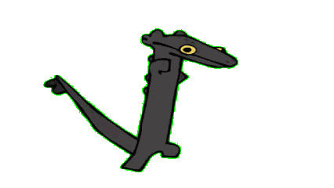
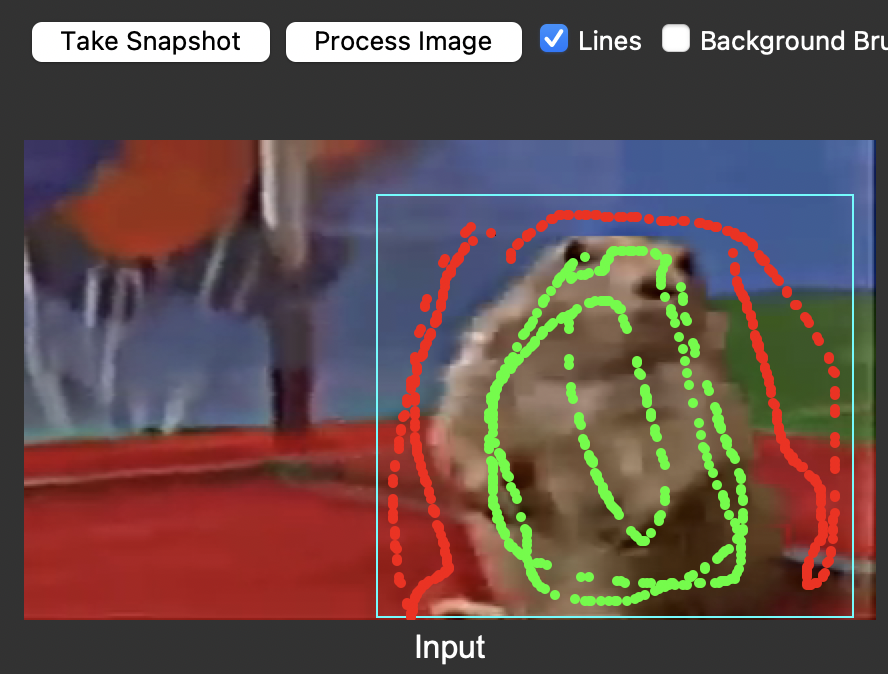
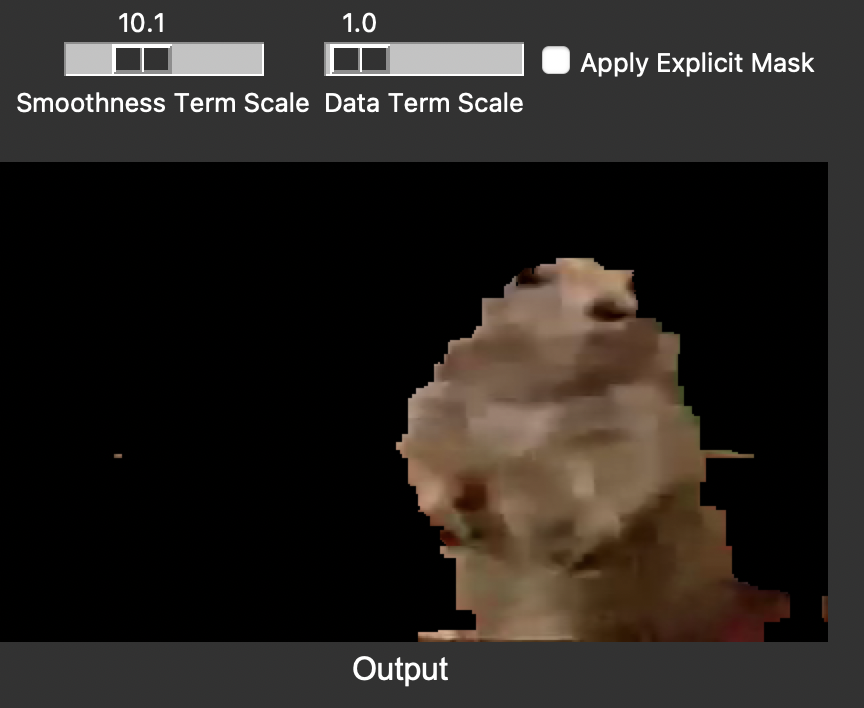
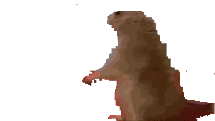

# Video to Transparent Background GIF

Final Project for Computer Vision course AY2024 Spring\


## Aims

This project aims to convert video files into transparent background GIFs using 2.5D Markov Random Field. It provides an easy-to-use GUI interface which allows the user to select his/her region of interest to segment. (similar to GrabCut)

## Usage

1. Clone the Github Repository and `cd` into the directory
   ```bash
   git clone https://github.com/minsuk00/VideoToGIF
   cd VideoToGIF
   ```
2. Install the required dependencies using package manager (activate virtual env if necessary)
   ```bash
   pip install -r requirements.txt
   ```
3. Run application
   ```bash
   python main.py
   ```
4. After loading video (mp4 file), move the frame to the desired start point
5. Draw a rectangle, and draw lines to indicate foreground and background\
   
6. Process image to construct a GMM for foreground and background. (Iterate 5-6 till result is satisfactory)\
   
7. Run video segmentation & download as GIF (below is an example result case)\
   

## License

[MIT](https://choosealicense.com/licenses/mit/)
